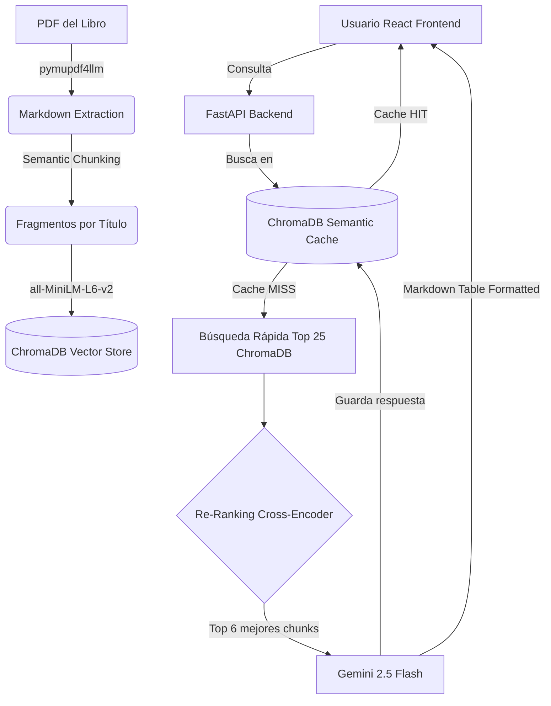

# 🧮 IA Calculadora — Investigación de Operaciones (Advanced RAG)

Sistema inteligente de nivel Enterprise con **Advanced RAG (Retrieval Augmented Generation)** y **React** sobre Gemini para resolver problemas matemáticos de Investigación de Operaciones.

> Le da a Gemini el contexto exacto de un libro de IO (Hillier, 10ª edición) procesado con fragmentación semántica para que responda con base en la teoría estricta, no en su conocimiento general.

---

## 🏗️ Arquitectura Avanzada

El proyecto pasó de ser un script simple a una aplicación web moderna (React + FastAPI) con un pipeline RAG altamente optimizado.



### Módulos Principales

| Directorio/Archivo | Función |
|---|---|
| `frontend/` | Aplicación **React + Vite** con historial de chats, Markdown render y efecto Typewriter. |
| `src/api.py` | Servidor **FastAPI** que expone el endpoint del motor RAG. |
| `src/embeddings.py` | Pipeline de Embeddings (Carga Markdown, Semantic Chunking, Local HF Embeddings y Re-Ranking). |
| `src/rag.py` | Orquestación de Gemini, Prompts estrictos de IO y Caché Semántico. |
| `src/config.py` | Configuración centralizada de rutas y modelos. |

---

## 🚀 Mejoras del Advanced RAG (V2.0)

El sistema RAG fue llevado al estado del arte para **maximizar la precisión matemática y reducir a cero los costos de embedding**:

1. **Embeddings Locales Gratuitos:** Se reemplazaron los embeddings de paga de Google por `all-MiniLM-L6-v2` de HuggingFace corriendo localmente a costo cero.
2. **Extracción Markdown:** Reemplazamos `PyPDFLoader` por `pymupdf4llm` para conservar las tablas y fórmulas.
3. **Semantic Chunking:** LangChain `MarkdownHeaderTextSplitter` agrupa los algoritmos matemáticos por su título (Ej. `# Símplex`), evitando que se rompan por saltos de página físicos.
4. **Context Compression (Re-Ranking):** Se extraen 25 fragmentos y un modelo `CrossEncoder` local los califica de 0 a 10. Solo los 6 perfectos se envían a Gemini, erradicando alucinaciones y reduciendo costos de tokens de entrada en un 60%.
5. **Caché Semántico:** El sistema almacena vectores de preguntas pasadas. Si detecta una pregunta *semánticamente similar*, devuelve la caché sin despertar a Gemini.

---

## ⚙️ Instalación y Ejecución Local

### Prerrequisitos
- Python 3.11+
- Node.js 18+ (Para el frontend React)
- API Key de [Google AI Studio](https://aistudio.google.com/apikey)

### 1. Clonar el repositorio
```bash
git clone https://github.com/SebzSGC/IA---Calculadora.git
cd IA---Calculadora
```

### 2. Backend (FastAPI + RAG)
```bash
# Crear entorno virtual e instalar dependencias
python -m venv .venv
.venv\Scripts\activate
pip install fastapi uvicorn langchain-google-genai langchain-community langchain-huggingface chromadb pymupdf4llm sentence-transformers python-dotenv

# Crear archivo .env en la carpeta src/
# GOOGLE_API_KEY=tu_api_key_aqui

# Iniciar servidor (El primer arranque tardará ~5 mins construyendo el ChromaDB)
python src/api.py
```

### 3. Frontend (React)
Abre otra terminal y navega a la carpeta del frontend:
```bash
cd frontend
npm install
npm run dev
```
La interfaz estará disponible en `http://localhost:5173`.

---

## 💰 Costos Optimizados

| Operación | Costo (V1.0) | Costo Actual (V2.0) |
|---|---|---|
| Generar embeddings iniciales | ~$0.10 USD | **$0.00 USD** (Modelo Local HF) |
| Repetición de consultas similares | ~$0.004 USD | **$0.00 USD** (Caché Semántico) |
| Consumo de tokens (RAG por pregunta)| Alto (Contexto ciego) | **Reducido -60%** (Re-Ranking Cross-Encoder) |

---

## 🛠️ Tecnologías

- **Backend:** FastAPI, Python, LangChain.
- **Frontend:** React, Vite, react-markdown, KaTeX (para matemáticas).
- **Inteligencia Artificial:** Google Gemini 2.5 Flash, HuggingFace (`all-MiniLM`, `ms-marco-MiniLM`), ChromaDB.
